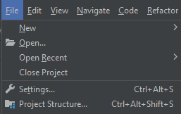
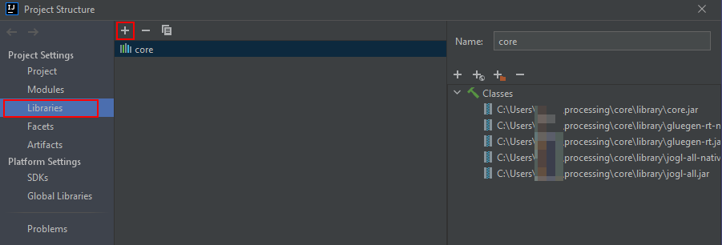

# Processing-Game-Engine
A simple 2D game engine in Java using the Processing library(?), with a level editor, level saving, and a component system similar to Unity.

# How to make something similar (IntelliJ):

Open the "Project Structure" menu.

In the Project Structure menu, go to Libraries and press the +. This will open a file explorer window.

Navigate to the folder where the .JAR files are located (I put them in the [lib](/lib) folder, but you can get them from /core/library in a [Processing](https://processing.org/download) install.) and add them.